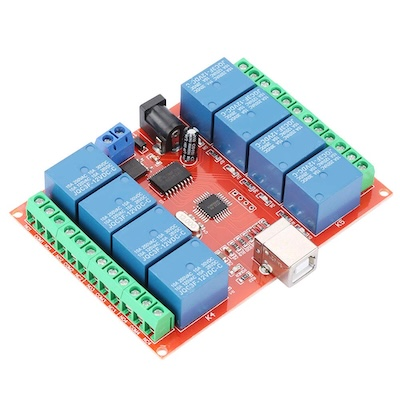
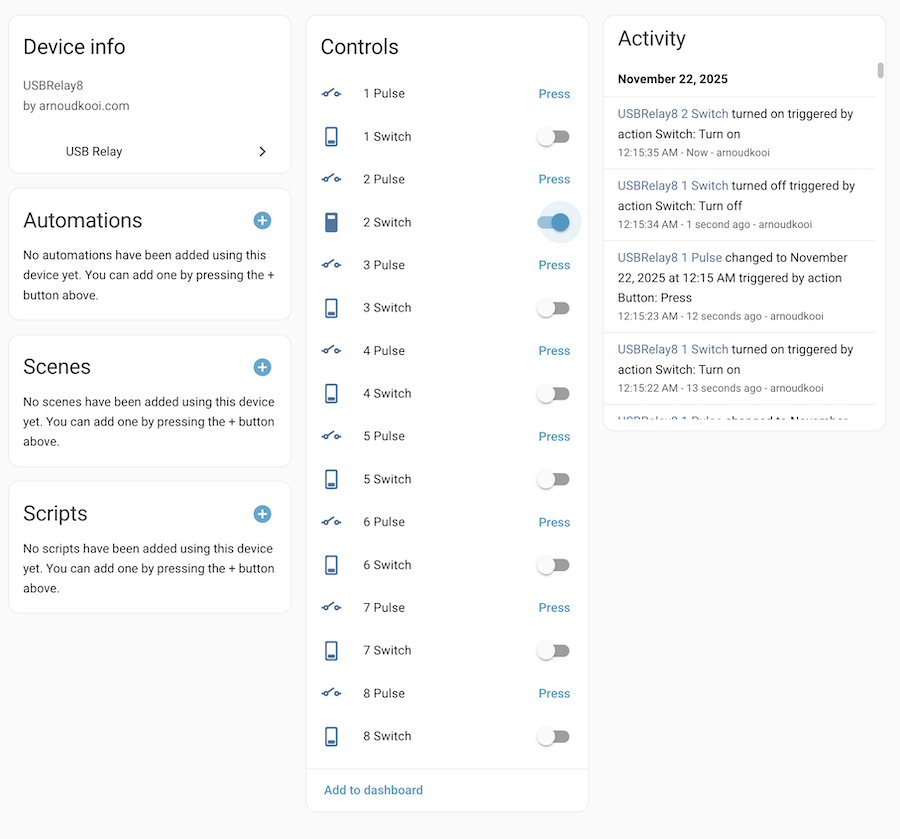

# HID USB Relay for Home Assistant



Control **HID USB Relay boards** (Commonly `16c0:05df`) directly from Home Assistant. 

[](https://my.home-assistant.io/redirect/hacs_repository/?owner=arnoudkooi&repository=ha-hid-usbrelay&category=integration)

## Features
- **Full UI Configuration**: Auto-discovery and setup via the Integrations page.
- **Per-Channel Customization**: Configure custom names and area assignments for each relay.
- **Automatic Area Assignment**: Areas propagate to HomeKit Bridge and other integrations.
- **Device Registry**: Relays are grouped under a single device.
- **Pulse Buttons**: Each relay gets a dedicated "Pulse" button entity (1s duration).
- **Native Integration**: No Node.js or external scripts required.
- **Automatic Discovery**: Detects 1, 2, 4, or 8 channel boards.

## Installation (via HACS)

1.  Click the **Open in HACS** button above.
2.  Click **Download** (you might need to "Redownload" if updating).
3.  **Reboot device** (Don't just restart Home Assistant).

## Configuration

1.  Go to **Settings > Devices & Services**.
2.  Click **Add Integration**.
3.  Search for **HID USB Relay**.
4.  If your device is plugged in and accessible, it will be discovered automatically.
5.  Click **Submit**.

### You will get:
*   **Switch Entities**: One switch per relay channel (On/Off control)
*   **Pulse Buttons**: One button per relay channel (Momentary 1s pulse)

### Customization (Optional)
After setup, click **Configure** on the integration to:
*   **Set custom names** for each channel (e.g., "Living Room Light", "Garage Door")
*   **Assign areas** using the area selector to automatically organize entities by location
*   Area assignments automatically propagate to integrations like HomeKit Bridge
*   Names default to "Relay 1", "Relay 2", etc. if not customized



---

## Troubleshooting

### "No HID USB Relay found"
If the setup fails saying it cannot find the device:

*   **HA OS on Bare Metal / Raspberry Pi**: You **MUST perform a FULL HOST REBOOT** (Shutdown -> Power On). A simple "Restart Home Assistant" is **NOT enough** to apply the USB permissions.
*   **Virtual Machines (Proxmox, ESXi, VirtualBox)**: You must **pass through** the specific USB device `16c0:05df` to the VM.
*   **Docker**: Map the USB bus:
    ```yaml
    volumes:
      - /dev/bus/usb:/dev/bus/usb
    privileged: true
    ```

### Linux Permissions (Manual Install)
If running manually on Core/Docker, you may need a udev rule:

`/etc/udev/rules.d/99-usbrelay.rules`:
```bash
SUBSYSTEM=="usb", ATTRS{idVendor}=="16c0", ATTRS{idProduct}=="05df", MODE="0666"
SUBSYSTEM=="hidraw", ATTRS{idVendor}=="16c0", ATTRS{idProduct}=="05df", MODE="0666"
```
Reload: `sudo udevadm control --reload-rules && sudo udevadm trigger`
